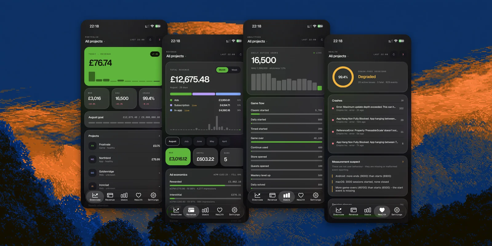

# Hey, I'm Can 👋

Software developer and indie founder in London. I ship mobile apps and games, then build the tools I wish existed to run them.

## ⛵ Currently building: Helm

**One dashboard for your entire app portfolio.** Revenue, users, crashes and store reviews from RevenueCat, AdMob, App Store Connect, PostHog and Sentry, pulled into one Supabase hub, with a web console and an iOS app + home screen widget.

**[→ github.com/canakyuz/helm](https://github.com/canakyuz/helm)** · open source, AGPL, bring your own Supabase. My favorite part: the Health tab tells you when your analytics are lying to you.

## 🛠️ Also on my desk

- **[Wesan](https://wesan.co)** - my one-person software studio: AI products, developer tools, and a small game portfolio that funds them.
- **Dante** - a grounded AI coaching app; every claim in its knowledge corpus has a source or it does not ship.
- Writing about building all of this at [canakyuz.co](https://canakyuz.co/).

## 🧰 Tools I reach for

`TypeScript` `React Native / Expo` `Next.js` `Bun` `Supabase` `Postgres` `Go` `Rust`

Tech: whatever the problem needs.

## 📫 Reach me

**canakyuz23@gmail.com** · off-screen: books and heavy barbells.
